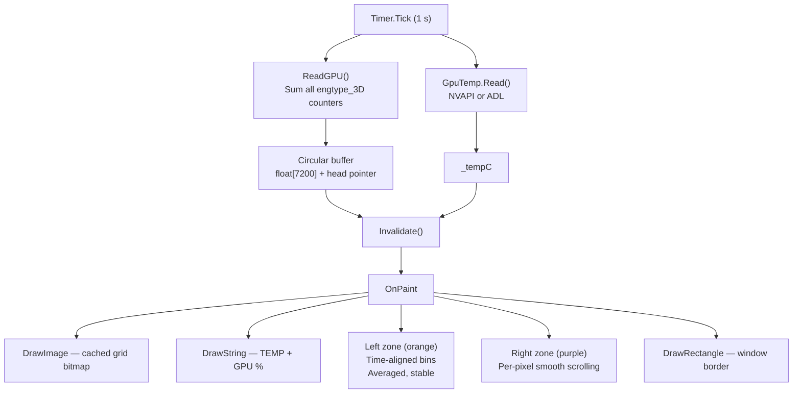
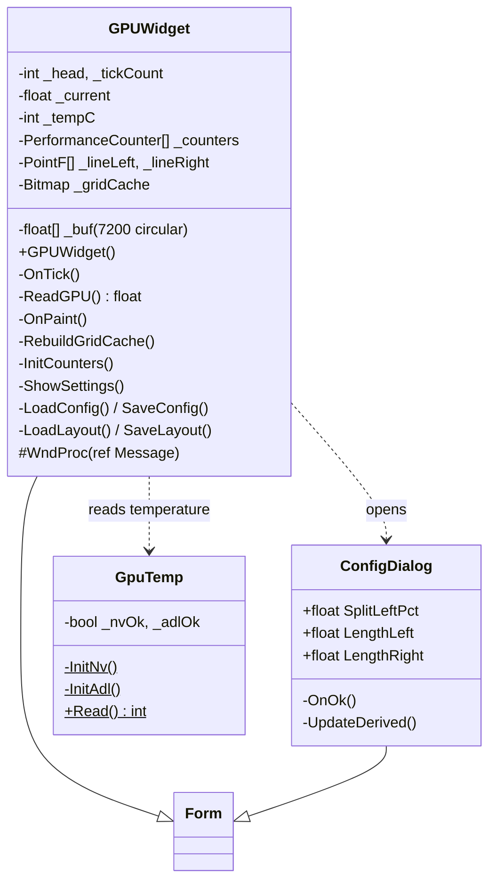
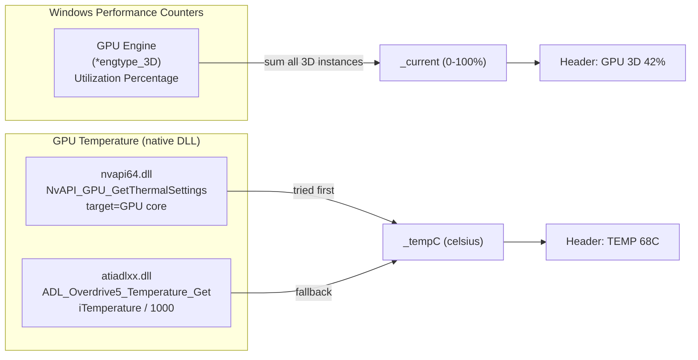
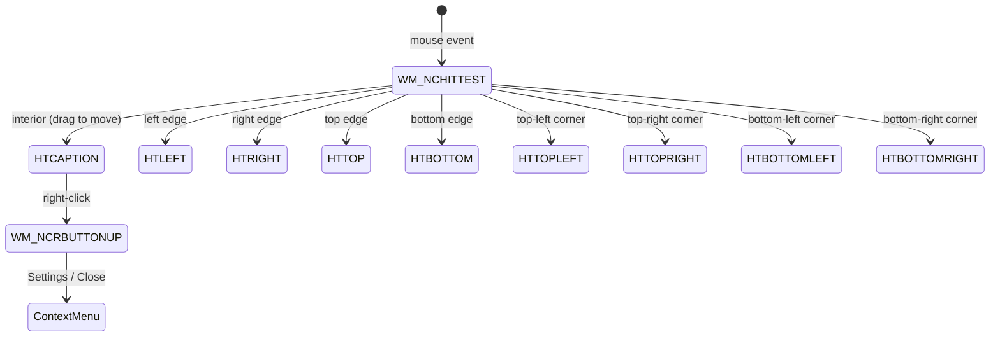
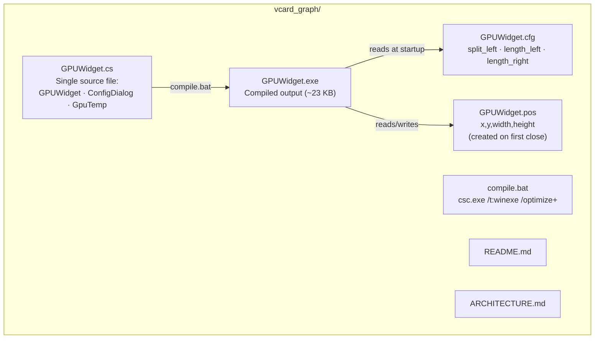

# Architecture

Visual reference for the GPU Widget. All diagrams use [Mermaid](https://mermaid.js.org/) syntax.

---

## 1. Runtime Loop

How one second of widget operation flows from timer tick to painted frame.

---

## 2. Class Structure

All types in GPUWidget.cs and their relationships.

---

## 3. Data Sources

Where the widget gets GPU utilisation and temperature, and how each is resolved.

---

## 4. Window Chrome via WndProc

How borderless drag, resize, and right-click are handled without a title bar.

---

## 5. File Map

